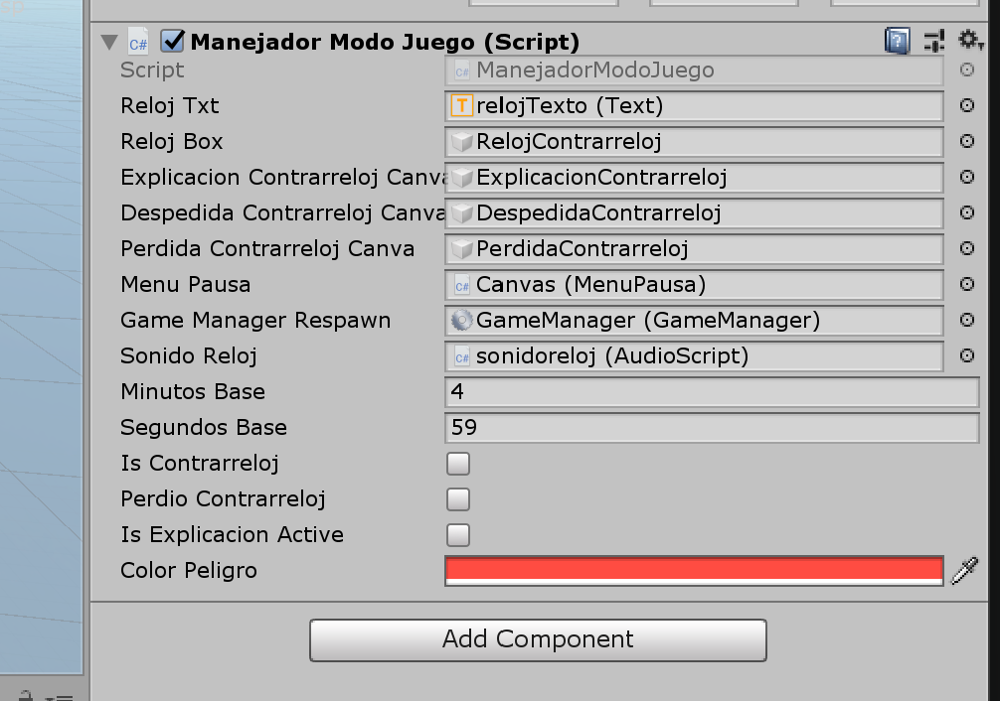

[⬅️Volver](../README.md)
# ⏱️Modo Contrarreloj
Este modo se creó para presentar un desafío extra a los jugadores. La propuesta justifica su implementación para mejorar coordinación mano-ojo.

La lógica de este código se encuentra en los archivos **`ManejadorModoJuego.cs`**.

## ManejadorModoJuego

Este componente de Unity controla la **lógica del modo contrarreloj** en el juego.  
Su función principal es manejar el temporizador, mostrarlo en pantalla, activar y desactivar interfaces relacionadas, y coordinarse con otros scripts como el **`MenuPausa`** y el **`GameManager`**.

###  Relación con otros scripts

- **`MenuPausa.cs`**  
  - Llama a los métodos de `ManejadorModoJuego` para activar, pausar o finalizar el modo contrarreloj.  
  - Habilita/deshabilita controles del jugador y gestiona la interfaz de pausa dependiendo del estado del cronómetro.  

- **`GameManager.cs`**  
  - Usado para reiniciar o teletransportar al jugador cuando se pierde el modo contrarreloj.  

- **`AudioScript.cs`**  
  - Maneja el sonido de advertencia cuando el tiempo está por agotarse.  

###  Funciones principales

- **`activarTemporizador()`**  
  Inicia el cronómetro y habilita la caja de reloj en pantalla.  

- **`contadorMinutos()`**  
  Resta segundos en cada frame y actualiza el temporizador. Detecta pérdida cuando el tiempo llega a cero.  

- **`actualizarTextoContador()`**  
  Muestra el tiempo restante en el `Text relojTxt`. Formatea correctamente segundos menores a 10.  

- **`desactivarCronometro()`**  
  Oculta el reloj y reinicia valores base de minutos y segundos.  

- **`activarExplicacion()`**  
  Activa la pantalla con instrucciones sobre el modo contrarreloj.  

- **`activarDespedida()` / `desactivarDespedida()`**  
  Controlan las pantallas de finalización (victoria o derrota).  

- **`perdidaModoContrarreloj()`**  
  Reinicia valores, desactiva el cronómetro, detiene sonidos y teletransporta al jugador al punto de respawn.  

- **`accionesDeAviso()`**  
  Cambia el color del reloj a `colorPeligro` y activa un sonido de advertencia cuando quedan menos de 3 minutos.  

### ️ Variables expuestas

- `minutosBase` y `segundosBase`: tiempo inicial del modo contrarreloj.  
- `relojTxt`: referencia al texto de UI donde se muestra el cronómetro.  
- `relojBox`: contenedor gráfico del reloj.  
- `explicacionContrarrelojCanva`: interfaz que explica el modo.  
- `despedidaContrarrelojCanva` / `perdidaContrarrelojCanva`: interfaces de finalización.  
- `colorPeligro`: color que toma el texto cuando el tiempo está por terminar.  

El modo contrarreloj utiliza variables con `[SerializeField]`, lo que significa que no es necesario utilizar otros métodos dentro del código para relacionarlas, se pueden asignar los valores(objetos) a las variables desde el editor de Unity

### 🔗 Integración con `MenuPausa`

El `MenuPausa` controla la transición entre los modos:  

- `contextoContrarreloj()`: muestra la explicación del modo antes de iniciarlo.  
- `ModoContrarreloj()`: arranca el temporizador llamando a `activarTemporizador()`.  
- `ModoNormal()`: desactiva el cronómetro y muestra la pantalla de despedida.  
- `reiniciarModoNormal()`: oculta pantallas de finalización y devuelve control al jugador.  

### 📊 Flujo básico de uso

1. `MenuPausa` llama a **`contextoContrarreloj()`** → se muestra la explicación.  
2. Jugador inicia → `ModoContrarreloj()` activa el temporizador.  
3. Mientras el tiempo corre:  
   - Si faltan menos de 3 minutos → se activa el aviso visual y sonoro.  
   - Si el tiempo llega a cero → se ejecuta `perdidaModoContrarreloj()`.  
4. Al finalizar, se muestra `activarDespedida()`.  
