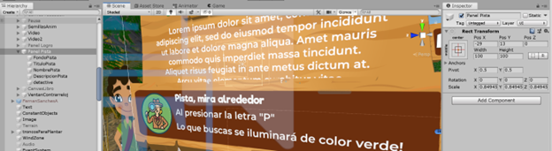
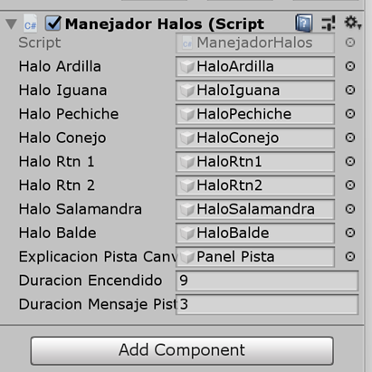

[⬅️Volver](../README.md)
# ManejadorHalos

Este componente de Unity se encarga de **gestionar la activación temporal de halos como pistas visuales** en el juego.  
Su objetivo es ayudar al jugador a identificar elementos clave en cada estación, encendiendo y apagando objetos resaltados durante un corto período de tiempo.  

## Relación con otros scripts

- **`GameManager.cs`**  
  - Se utiliza para obtener la **estación actual** (`currentStation`) y decidir qué halos deben activarse.  

##  Funciones principales

- **`Update()`**  
  Detecta si el jugador presiona la tecla de pista (`P`). Si hay halos asociados a la estación actual, los activa por un tiempo definido.  

- **`DispararPistaEstacionActual(int estacionActual)`**  
  Controla la lógica de mostrar los halos:  
  - Valida la estación actual.  
  - Verifica si existen halos registrados en el diccionario.  
  - Lanza la corrutina que enciende y apaga los halos.  

- **`ObtenerEstacionActual()`**  
  Retorna la estación actual usando `GameManager.instance.currentStation`.  
  Devuelve `-1` si no se encuentra disponible.  

- **`EncenderYApagar(List<GameObject> lista)`** *(corrutina)*  
  - Activa todos los halos de la lista.  
  - Espera el tiempo definido en `duracionEncendido`.  
  - Desactiva los halos para que desaparezcan.  

##  Variables expuestas

- `haloArdilla`, `haloIguana`, `haloPechiche`, `haloConejo`, `haloRtn1`, `haloRtn2`, `haloSalamandra`, `haloBalde`: objetos de pista que se activan como halos.  
- `halosPorEstacion`: diccionario que asocia estaciones con sus listas de halos.  
- `teclaPista`: tecla que dispara las pistas (por defecto `P`).  
- `duracionEncendido`: tiempo en segundos que permanecen visibles los halos.  

## 📊 Flujo básico de uso

1. El jugador presiona la tecla **P**.  
2. El sistema obtiene la **estación actual** desde `GameManager`.  
3. Se valida si existen halos asociados en el diccionario `halosPorEstacion`.  
4. Si existen, se encienden por `duracionEncendido` segundos.  
5. Pasado ese tiempo, se apagan automáticamente.  

##  Ejemplo de estaciones y halos registrados

- **Estación 1** → Halos de *Ardilla*, *Iguana* y *Pechiche*.  
- **Estación 3** → Halo de *Conejo*.  
- **Estación 4** → Halos de *Ratón 1*, *Ratón 2* y *Salamandra*.  
- **Estación 7** → Halo de *Balde*.  

### Mensaje Pop Up, explicación de la Pista

Se añadió un cartel que explica lo que sucede al presionar la tecla ‘P’ , usando la misma estética que los carteles de anuncio de **`Logro Conseguido`**, esto en base a las ideas del director del proyecto, este cartel se encuentra dentro del **`GameObject Canva`**, el cual es responsable de acomodar todos los carteles que vemos en pantalla, se activa de la misma manera que los Halos, está referenciado en el controlador de Halos y se activa con una corrutina, su duración es de 3s encendido, se puede modificar desde el motor, está bajo la variable ‘Duración Mensaje Pista’

  

El GameObject del Cartel se llama **`‘Panel Pista’`**

  

