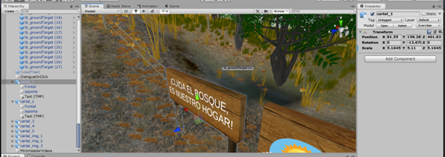
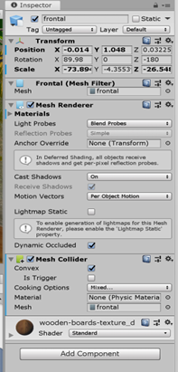
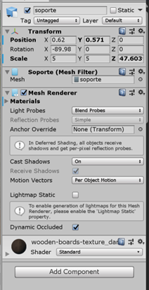
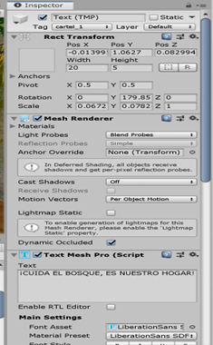
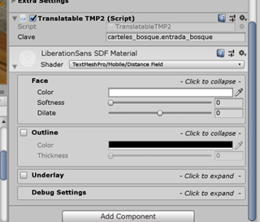

[⬅️Volver](../README.md)
# 🪧 Añadir Carteles al Sendero

Se buscaba añadir más elementos visuales al sendero y que a la vez contribuyan a informar más sobre los cuidados del bosque.  

Estos objetos se encuentran al final del **Panel Herencia** como `cartel_N`:

  

##  Estructura del Cartel

Cada cartel está compuesto por tres **GameObjects**:

### 1. Frontal
El diseño del cartel como tal, el tablón donde va a ir el texto.  

  

### 2. Soporte
Las patas que sostienen al cartel, los dos cilindros verticales.  

  

### 3. Text (TMP)
El texto que queremos mostrar en el cartel.  

  

Su atributo **Text Mesh Pro (TMP)** es la forma en que se añade directamente el texto desde el motor.

##  Traducciones
Cada cartel también tiene un componente (script) que contiene la lógica para hacer las traducciones.  

La **clave** es lo que será consultado dentro del archivo `.json` de textos y devolverá el valor correcto.  

  

