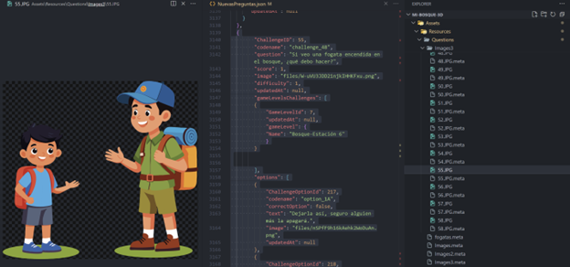
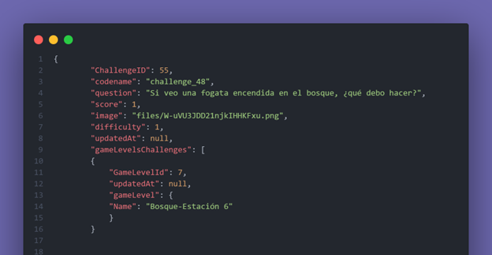
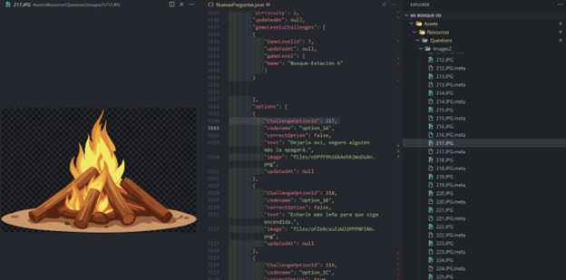
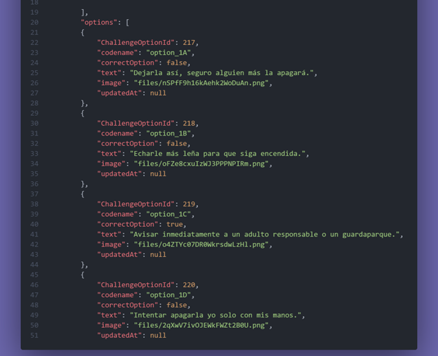
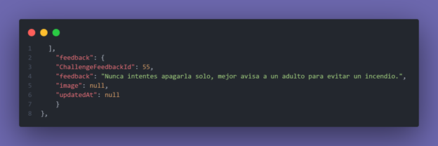

[⬅️Volver](../README.md)
# ❓ Nuevas preguntas
Cada vez que se quieran agregar nuevas preguntas, se deben colocar en el archivo **`NuevasPreguntas.json`**.  

La estructura de los objetos que representan las preguntas contiene varios apartados clave:

---

###  ChallengeID

Este número (`N`) representa la **imagen que se mostrará en el feedback** una vez la pregunta sea contestada.  
Es como la portada de la pregunta.  

Estas imágenes se cargan de la carpeta:  
`Assets\Resources\Questions\Images3\N.JPG`

  

###  Question

Es la **pregunta** que aparecerá en el tablero.  

###  GameLevelsChallenge

Es una lista que contiene otros objetos que representan los posibles lugares donde la pregunta puede aparecer aleatoriamente.  
Desde aquí podemos controlar en qué estaciones queremos que aparezca la pregunta.  

- **GameLevelID**: número de la estación.  
- **Name**: siempre se resta una unidad al `GameLevelID` y se escribe en el formato:  
  `"Bosque-Estación 6"`  
  Esto porque la pregunta se muestra al final del último desafío.  
  ⚠️ No puede ser 7, ya que después de la estación 7 se presentan los créditos.  

  

###  Options

Lista de las posibles respuestas (las opciones que se muestran en los carteles).  

Atributos principales:  
- **ChallengeOptionID**: número (`K`) que representa la **imagen portada de la opción**.  
  Se cargan de la carpeta:  
  `Assets\Resources\Questions\Images2\K.JPG`  

  

- **CorrectOption**: aquí se marca cuál es la opción correcta.  
  ⚠️ Debe haber **solo 1 correcta**.  
  Si se dejan más de una o ninguna, habrá errores con el feedback.  

  

## 💡 Feedback

Este apartado define la **retroalimentación** que aparece después de contestar una pregunta.  

- **ChallengeFeedbackId**: número (`N`) que representa la imagen portada del feedback.  
  Estas imágenes se cargan de la carpeta:  
  `Assets\Resources\Questions\Images3\N.JPG`  

- **Feedback**: el texto de retroalimentación que se muestra en el cartel.  

  

