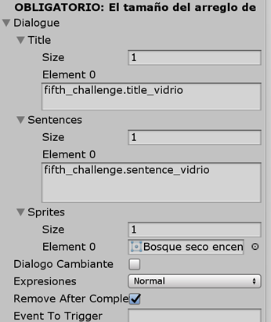
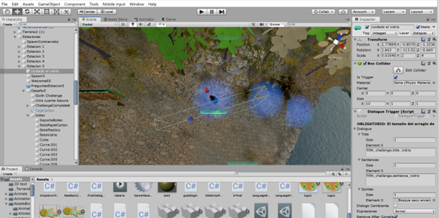

[⬅️Volver](../README.md)

# 💬 Mensajes Pop Up en el Sendero

Estos mensajes se añadieron para mostrar más información dentro del juego.  
Cada objeto de **Mensaje** tiene tres componentes principales:  

1. **Transform**  
2. **Box Collider**  
3. **DialogueTrigger**

---

###  DialogueTrigger

El **DialogueTrigger** forma parte de la implementación que ya estaba en la versión anterior.  
Es el código encargado de mostrar los mensajes que aparecen a lo largo del sendero.  

Este componente tiene un objeto **Dialogue**, encargado de almacenar la información que queremos mostrar.  

Desde el editor de Unity podemos manejar:  
- La cantidad de **títulos (title)**.  
- La cantidad de **oraciones (sentences)**.  

Ambos se definen en arreglos y **el número de títulos debe coincidir con el número de oraciones**.  

Si hay más de un texto, las **sentences** se mostrarán automáticamente, ya que el **Canvas** se actualizará solo.  

  

### ➕ Añadir un Nuevo Mensaje

Si se necesita añadir un nuevo mensaje:  

1. Copiar uno de los objetos que ya existen.  
2. Posicionarlo donde se requiera en el sendero.  
3. Modificar el componente **DialogueTrigger** con el nuevo contenido.  

  

### ️ Representación en el Editor

En la imagen podemos ver que las **líneas encerradas** representan nuestro objeto **Mensaje**.  
Estos objetos son invisibles dentro del juego, pero al acercarse el personaje, el **Box Collider** detecta el contacto y se activa el mensaje.  

En este ejemplo, se trata del mensaje sobre el **cuidado al dejar vidrios en los bosques**, ubicado frente a una botella de vidrio.  

  

